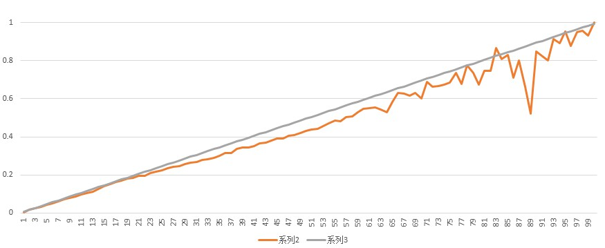

# LR sigmoid预测概率与实际概率的关系以及阈值截取

学习 LR算法的时候，书上说能给出概率估计值，我是百思不得其解，这真的就是概率吗？还是只是给出了个趋势而已，趋于1与趋于0分别代表不同的分类而已？

现在明白了，这个概率还是很靠谱的。因为所有机器学习都不能100%准确，而且训练集上的效果也未必完好泛华到测试机，所以应该说是，它在努力使得自己很靠谱。

对一个例子，特别检验了这种靠谱程度如何。检验方式是：以0.01的间隔把预测概率分为100个区间（把验证集中预测概率落在(p, p+0.01)区间的样本的预测值求和取平均，作为下面第三列），同时对于落在相应区间的样本统计出实际经验概率(作为第二列)。如果预估的准，两个数据应该像差不大。另外，只是在训练集上做了检测。

```
行号	验证集上概率	验证集上预估概率	次数
0	0.0032903814719	0.0059433181905	94214
1	0.0148402074158	0.015194859734	92182
2	0.022283227202	0.025101102694	115109
3	0.0317917320684	0.0349746774431	115313
4	0.0405871080981	0.0450592475161	124202
5	0.0487504994928	0.0550250154459	130132
6	0.0584239440151	0.0651540279772	131607
7	0.0703183476402	0.0749829981052	148297
8	0.0785914338411	0.0852732699183	175668
9	0.0871276901564	0.0947784210116	205239
10	0.095841396548	0.104918518435	198432
11	0.102571829319	0.114714569517	182516
12	0.112281498011	0.124924803419	158637
13	0.124059682505	0.134798872933	144632
14	0.141189445307	0.144906820521	122410
15	0.151926965871	0.154978303138	120163
16	0.160549634236	0.164880225749	111274
17	0.169861033168	0.174971929080	105133
18	0.178766369658	0.184900037108	92702
19	0.183659580358	0.194948059013	86693
20	0.193858504032	0.205004773018	81967
21	0.196145610278	0.215062856042	81725
22	0.208143749518	0.224903703247	77802
23	0.216488832925	0.235008733912	75445
24	0.224258598622	0.245010749707	73442
25	0.234750128442	0.254949903495	72017
26	0.240871994605	0.264999354399	72661
27	0.246249157114	0.274977421190	71184
28	0.257907688614	0.284973905678	66644
29	0.265467409303	0.294980253500	66430
30	0.268503289474	0.305038433540	65664
31	0.276903557227	0.314988799301	64629
32	0.281906864257	0.324979829246	61609
33	0.290987695377	0.334969398246	57133
34	0.301554128510	0.344936887563	52634
35	0.314414491391	0.354912529585	46814
36	0.314521679284	0.364927551895	45043
37	0.335620354488	0.374954249633	40227
38	0.342796309439	0.384916552848	38043
39	0.342610663273	0.394956140008	35355
40	0.351251486039	0.404925445490	31123
41	0.364496040594	0.414873958253	26014
42	0.370956545884	0.424848859734	21609
43	0.380865139949	0.434930717557	19650
44	0.390679767856	0.444948291674	17403
45	0.391957811470	0.454939256427	15170
46	0.407124681934	0.464942237732	13755
47	0.409778456837	0.474868888464	13090
48	0.421071556994	0.484955056634	11124
49	0.432375680061	0.494881921352	10477
50	0.436785130719	0.504871935253	9792
51	0.443261231281	0.514934637826	9015
52	0.455925969866	0.524954694507	8429
53	0.469268425347	0.53496979059	7354
54	0.484604006992	0.544995472637	7437
55	0.48284166165	0.554909169175	6644
56	0.502892813642	0.565084095615	6568
57	0.508965083360	0.57500668921	6358
58	0.530638029059	0.584818194883	6332
59	0.546558704453	0.594906804993	5928
60	0.551181102362	0.604921501556	5461
61	0.555337133871	0.614833145272	5087
62	0.543612710599	0.624790543826	4689
63	0.527453606275	0.634778241821	5227
64	0.583488805970	0.645254060168	4288
65	0.629323899371	0.655425393082	5088
66	0.628916741271	0.664599254700	4468
67	0.618038947728	0.674902466689	2927
68	0.632049518569	0.684098026135	2908
69	0.602654176425	0.694846572990	2562
70	0.687356321839	0.705602497126	3480
71	0.662456946039	0.714764592423	2613
72	0.665934065934	0.724945906593	1820
73	0.673318129989	0.734798534778	1754
74	0.687094448450	0.744814614275	1387
75	0.736228127025	0.755402553467	1543
76	0.677215189873	0.765237793852	1106
77	0.775289017341	0.775167268786	1384
78	0.734895191122	0.784865561036	811
79	0.676274944568	0.794284434590	902
80	0.745954692557	0.804978656958	618
81	0.747540983607	0.814922983607	610
82	0.866781017724	0.826022161235	1749
83	0.808738664468	0.834904707337	1213
84	0.830390920555	0.844039836066	1586
85	0.712437095615	0.853831135873	1391
86	0.800813008130	0.864479349593	246
87	0.662447257384	0.874365147679	237
88	0.520491803279	0.886222295082	244
89	0.847222222222	0.894907847222	144
90	0.823529411765	0.904418571429	119
91	0.800000000000	0.915055428571	105
92	0.916030534351	0.925571297710	131
93	0.890909090909	0.935030545455	55
94	0.954545454545	0.945972727273	132
95	0.877777777778	0.954807111111	90
96	0.949367088608	0.965128227848	79
97	0.958333333333	0.976104166667	24
98	0.931034482759	0.984455862069	29
99	1.000000000000	0.993540000000	3
```

把第二、三列画图（第3列对应灰色，第2列对应红色）如下，可以看出整体趋势还是比较接近的。在最右边红色曲线有震荡因为频数变小的缘故。灰色比较直因为是按预估值做的区间划分。



广告最终展示排序常用“点击率*拍卖价”。这样看还是合理的。只要点击率预估得准，这样确实能反映概率意义下的收入。注意这时我们并不关心单条广告是否真的会被点击，而关心的是一大批广告是否能有效地有相当数量的点击。这样如果有一批比如说一万条预测概率都是0.1的广告展示，固然不好说而且实际也不关心任意单条是否被点，但是按概率规律，几乎必然有1000条左右会被点击的。

### Note：
1. 如果0/1分类的类别不均衡，训练LR的时候可能会采取一些手段。经测试，不采取任何手段，上面特性仍然成立。如果引入采样均衡类别，必然打破以上特性。如果对正负例给以不同的权重的参数更新，是否会打破以上特性，没测试，应该会打破。
2. 从上面表格的频次可以看到，数据在概率小于0.5下分布更多，这是因为这是从一个正例（远）少于负例的的数据集得到的。反过来，如果正例（远）少于负例，必然数据在概率小于0.5下分布更多（该概率是正例概率，大于0.5说明更可能是正例，如果大于0.5处数据更多，则正例必然多于负例）。  
   LR分类靠卡概率阈值。如果类别均衡，卡0.5自然没啥问题。如果类别不均衡，卡0.5就不合适了——0.5左右的数据数量差别太大。如果卡0.5，则数据量少的那一端数据被归属于一类，数据量多的一端属于另一类。后者会导致大量少数类（甚至大多数的少数类）被误分到多数类。套到个具体例子上，假设是检测得病率很低的某疾病，正例是有病，那么卡0.5会导致病人中的大多数被漏检，显然不合适。

### 关于阈值截取：
1. Choosing Logisitic Regression’s Cutoff Value for Unbalanced Dataset：http://ethen8181.github.io/machine-learning/unbalanced/unbalanced.html
2. https://stats.stackexchange.com/questions/6067/does-an-unbalanced-sample-matter-when-doing-logistic-regression
3. Logistic Regression in Rare Events Data：https://gking.harvard.edu/files/0s.pdf
