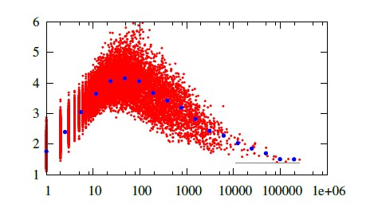

# 关于 word2vec 词向量的长度

为了得到句向量，一种方式是词向量直接取平均，另外可以用tf-idf作为weight作加权和。后者看起来很有道理。不过据使用经验，以及别人的道听途说，加权和并不比直接取平均有什么（或者有多少）优势。

想想word2vec的训练过程，就是多个词的词向量直接相加，然后预测中心词。这里就没有用任何权重。所以直接词向量相加得到句向量的合理性，也是可以理解的。

另外，以任何权重相加得到句向量，有一个重要点是，词向量的向量长度，到底有什么特点？如果本身这个长度值就差别很大，再加权求和——就等于放缩了向量长度然后求和——那么所得结果有任何诡异表现就都是有可能的了。

那么词向量的向量长度有什么特点呢？

训练词向量的时候，随机初始化会使得每个向量的初始长度一样。最后训练完，长度则会变得有显著差别，最大值与最小值会差别很大。

根据，《Measuring Word Significance using Distributed Representations of Words》，高频低频两个极端的词的向量长度都会小，频度适中的词向量长度会较大。词频与词向量长度呈下图形状。随着词频增大，长度先增后降。

按作者解释，词向量长度，取决于训练时参数更新的方向上的累加。

如果词语是高频词，比如停用词，那么词的上下文没有特定性，比较分散，那么更新该词的向量的时候，哪个方向上都有，于是异向抵消，其向量长度就会小。

对于低频词，往往该词的上下文模式固定，也就是参数更新的方向比较一致。于是该词每出现一次，该方向上更新一次，出现越多，同方向上更新越大，导致词向量长度越大。对于太低频的词，只是缺乏足够机会拉高其向量长度。

这也就是说，词向量长度反映了词频大小。

note：文章就word2vec向量而论，对于其他词向量，以及就地对one-hot训得的词向量会怎样，没论及。不过想来也有异曲同工值得参考之处。
