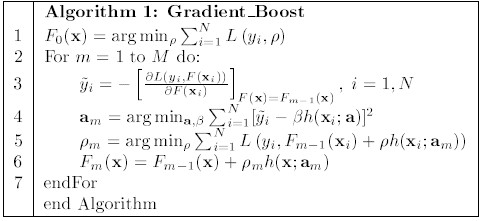
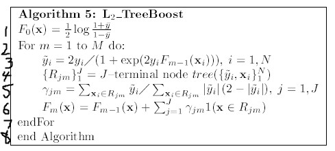
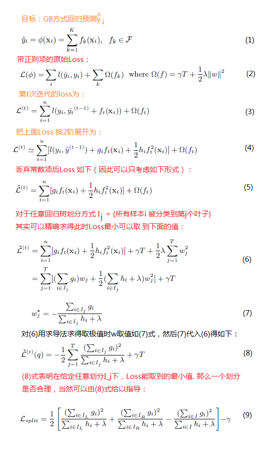

# 梯度提升与 GBDT、XGBoost

梯度提升（gradient boost）是一套解决回归（若是分类也需设法转化为回归）问题的思想或算法框架，能把一堆弱算法以特定方式串起来。弱算法（弱回归器）可以是树（这时就是所谓的gbdt），也可以不是。

一般机器学习方法是求得一个具体的映射函数 y = f(x1, x2, ..., xn)， 比如线性组合。而GB则是另一种流派，希望步步为营，靠多个delta逐步逼近y，从而求得y值（打个比方，炮弹击打目标。非GB方式是希望一炮打中。而GB则是炮弹落地后重新起飞朝目标进发，直到打中目标）。 

GB训练当然是希望拟合{ $y_i$ }，而拟合的标准，就是距离最近；而所选的距离的定义当然还是 loss 函数。
具体到 GB 算法上，如上图（其为log loss）：
1. 首先算出以“当前回归值”为基点（离ground truth value当然应该是越来越近了）朝着目标{y_i}的梯度，也就是求出前进方向（第3行），它就是所谓的 pseudo response。
2. 然后求前进步长。步长是梯度的一个放缩因子，如果提前知道了步长，那么让弱算法（弱回归器）来步进这么长就是ok的了。但是即使你知道该前进多长，弱算法未必一定前进这么长（准确率难以100%）。最理想的弱算法在各个样本点上的步进长度是正比于相应梯度分量的，所以应该“尽量”先让弱算法前进梯度各分量这么长，也就是“回归”梯度值（第4行）—— 对应于GBDT，则是进行子决策树（虽名为决策树，其实干的是回归）的学习。
3. 然后根据回归情况，选出针对全方向梯度值的最佳放缩因子（第5行），使得总loss是最小的。（不过这一步是比较难的，往往用**线性搜索法**求得）
4. 接着令最终回归值累加"弱算法回归出的预测值*步长"这样一个增量。这样朝着目标更近了一步。

这样，GB框架的具体应用，无非是确定弱回归算法而已了。如果用决策树，就是GBDT。

首先以梯度值（第3行）为目标构建回归决策树（第4行；对应第1图的第4行），然后就是寻找最佳前进步长（第5行；不能直接得解则需估计出值或者线性搜索）。做法是一样的。

不过大概了为了提高预测效果吧，GBDT又进了一步：步长放缩因子可以是统一的（如第1张图第5行），但如果每个样本点选用不一样的更适配自己的步长，效果应该更好吧？GBDT确实就是这样做的，它把步长合并进了弱回归树叶子节点的取值。这样只需要先按梯度构建回归树（第4行），然后把叶子节点取值重新选取一遍就ok了（第5行）。重给叶子节点定最优值，可能比较复杂，需要牛顿公式等任何合适的方法，所以才有上面第五行那样的复杂形式。（但总之，都是为了本迭代下得弱回归器能得到最小的loss值）

（note：上图第4行其实只是拿到了树的划分区间，并没提到节点取值，但构建树的过程中，其实已经把节点值定好了，只是这里因为还会取代它，所以第4行才不提而已）

## 关于xgboost

xgboost 思路如上图。

没用原生的loss函数，而是用了二阶展开的近似（只冲这点的话，其效果不可能更好）。但是，用此二阶近似后，却很容易一步求得该近似函数的精确极值，所以极大加快了收敛。

网上说其相当于用牛顿法在优化，而牛顿法本身是收敛更快的。考察上面公式，牛顿法也是（或者说形式上等价于）通过直接求解二阶展开的极值点来优化的，所以说xgboost也用了牛顿法，信然。

网上还说xgboost所以用二阶展开，一个原因是为了方便自定义loss函数。否则如普通gbdt，处理一般loss很费解的。用上面方式，确实实现了任意二阶可导函数，皆可作为loss来统一方式处理。误差只在于二阶近似展开，但在极小邻域内，此展开是有效的。

### 几个问题：
1. 什么是回归？  
一句话说，回归是在损失函数最小化意义上的回归。
理想情况下，回归就是预测值和目标值一模一样。但现实往往做不到”完全相等“这点。于是需要定义回归好坏的标准。这就是损失函数要干的事。因此回归本质上就是令loss函数最小化。可以认为**损失函数就是一种新定义出的距离公式。回归效果好，就是在这种新的距离标准下距离小**。一般的回归损失函数，比如最小二乘，差绝对值等损失函数希望达到的目标是和我们的直观一致的。或许存在这样的损失函数：损失足够小后，预测值和目标值居然取值差别很大！
2. 关于回归目标值  
有些情况下，往往不存在（或者不显式存在）如最小二乘中那样明晰的目标值。
分析 GB 思想的执行流程，GB 本质上只是提供predicted value前进的前进方向，以及该方向上的步长，方向与步长是根据loss算出来的，GB并不知道也不关心（loss来关心）目标值是什么。GB 执行过程更像是低头爬山，如果目标是比谁爬得更高，那它就一直爬就是了。有时又像是探宝，虽然目标就在那里，但你并不知道具体位置，你一直低头按秘法前进，走着走着或许就到了。
比如LTR算法lambdaMart，是在回归对于doc的得分。那对于每篇doc，目标回归值应该是什么？没人说得出，而且不存在也没人关心具体取值！  
关于用于分类时的目标值：GBDT处理分类问题, 固然可以直接回归分类label取值蛮干，更常见方式是对 log(sigmoid) 或 log(softmax） 形式的损失函数作回归。这时候的预测值——按上面图方式——是sigmoid(F) 及 $\frac {exp(Fi)}{\sum_j exp(F_j)}$ 中的F，是在回归逼近无穷。
3. 学习率  
GBDT学习率指预测值每次每次迭代中不全加，而只加被加数和学习率的乘积那么大。这当然是为了防止在测试集上的过拟合。
一般机器学习算法的学习率，是为了在训练集上的收敛；如果真取值1，往往训练集上效果都很差。而GBDT中则不同。学习率取1的时候，反而在训练集上会有最佳表现。取更小值，只是为了防止过拟合，同时往往会影响在训练集上的表现。为了保证效果，更小学习率需要更多轮迭代。

### gbdt小结
神经网络类的方式，是吧把样本带进loss函数，对模型参数{w}求导。而GBDT则是把对每个样本求导，每个”样本”当作了一个点。这样得到>的正是：每个样本点冲着怎样的方向（梯度）去步进累加predict value，才更容易导致总loss更小。

得到每个样本点的理想步长后，再用回归树拟合这些步长，使得各个样本点别自以为是，而是少数服从多数——约略等于说，同一类的样本，用某种的平均，而不是各行其是。

这样一个迭代后，总的趋势上，根据各个样本所归属类别（处于不同树的叶子）的不同，分别按其类得到了梯度方向的——从而也使最快方式地——趋于目标值。多轮之后，就足够拟合目标值了。
