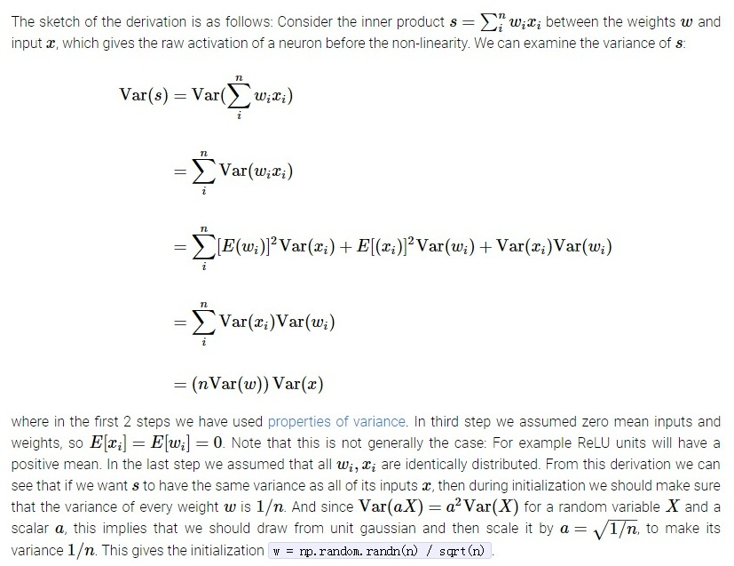

# 神经网络：参数的初始化

神经网络的第一层输入往往是0均值1方差，对于多层深度神经网络，每层的输出都是下一层的输入，下一层的输入何尝不希望也是0均值1方差的呢？

好的初始化的一个目的，就在于让每层的输入相比第一层0均值1方差分布，别偏差太多（注意 batch normal也是在此处着力）。这可以说是需要好的初始化的一个直观解释。

据几天看相关资料，发现有如下几种比较有效的参数初始化方法：

### 0 均值，1/n 方差初始化 
对参数W按 0 均值，1/n 方差（ $1/\sqrt n$ 标准差），按平均分布 $U(-\sqrt{3/n}, \sqrt{3/n})$ 或或高斯分布 N(0, 1/n)（据说两者差别不大，现在多用高斯分布）随机初始化。n是该层 input 的 size。

Note: 
1. U(a, b) 平均分布的方差是 $(a-b)^2/12$, 故 $U(-\sqrt{3/n}, \sqrt{3/n})$ 平均分布的方差是 1/n.
2. 方差和标准差（stddev）的区别。方差是 $\sum((x-x')^2)/n$, 标准差是 $\sqrt{方差}$ .  正态分布一般表示为 N(均值, 方差), 或N(均值,  $标准差^2$ ) 形式, 从而以上正态初始化对应 $stdev=1/\sqrt n$ .
3. 所谓参数初始化，指的是对一个 $f(x w+b)$ 操作中的w的初始化，w是一个(n,m) 矩阵，f是激活函数。

### 0 均值，2/(n1+n2) 方差初始化 
假设网络层的输入 size 是 n1, 输出 size 是 n2，按 2/(n1+n2) 方差初始化。按平均分布 $U(-\sqrt{6/(n1+n2)}, \sqrt{6/(n1+n2)})$ 或高斯分布 N(0, 2/(n1+n2)) 随机初始化，分别对应tensorflow 中的tf.glorot_uniform_initializer 与 tf.glorot_normal_initializer。

### 0 均值，2/n 方差初始化
用于 ReLu 激活函数。则适合的初始化方式是2/n方差。正态下，取 $stddev=\sqrt{2/n}$ 。

Note: 
1. 0 均值，1/n 或 2/(n1+n2) 方差初始化不适用于ReLu。
2. n是输入size。按此出处文章，其实取输出 size 也可以。
3. 按照 http://cs231n.github.io/neural-networks-2/ 的建议，激活函数优选Relu，从而初始化也优选本方法总没错。

### 正交初始化
用以解决深度网络下的梯度消失、梯度爆炸问题。矩阵多次连乘，所得结果往往不是很大就是很小，如果是正交矩阵，则可以保持。正交初始化正是基于此。RNN因为深度太深，容易梯度消失/爆炸, 所以 RNN 可用之。
其详待补充。

参考：
- http://smerity.com/articles/2016/orthogonal_init.html
- http://blog.csdn.net/shenxiaolu1984/article/details/71508892

--------------------------------------------------

### 下面简述下背后原理。

首先要说明，各种初始化基本都是都是希望在深度多层网络下，不同层的激活值的分布能尽量相互保持一致与稳定，甚至希望不同层的梯度分布、反向传播来的梯度也相互保持一致与稳定。如果不能保持这种不同层间的激活值/梯度/反向传来梯度的取值一致与稳定，层数一多，就容易发生值的爆炸或消失，而这是不好的。

这也说明了，好的初始化，越是深的网络，越是有必要。如果没那么深，即使差的初始化也不会有太大关系了（从所看文章的推导逻辑，我严重觉得，只有几层的网络中，随便来个随机初始化（比如正态就取stddev=0.1）足矣。只是这样觉得，没验证）。

首先看 1/n 方差怎么来的。

可见： http://cs231n.github.io/neural-networks-2/#init ，同时截图如下：

如图 Var(x)  是 0 均值 1 方差的，希望激活也是0 均值 1 方差的，则n*Var(w) 也应该是0 均值 1 方差，由方差特性，w 需满足 1/n 方差（上述需要假设激活函数是（近似）线性的，比如tanh在0点附近）。

以上是从正向传播角度，让激活值和输入值尽量保持同均值（此处讨论中都是0均值）同方差。

如果再考虑到反向传播，则是每层的反向传来的梯度，以及算出的w梯度，都应该和最后一层保持均值、方差的一致。可以证明，为保持之，参数初始化需要满足 1/m方差, m是该层输出size。

如此一来，同样参数W，考虑到正向传播，则需要满足1/input_size 方差；考虑到逆向传播，则需要满足1/output_size 方差，难以调和。于是文章中取了个这种，就按方差= $\frac 2 {input\\_size+output\\_size}$ 好了。

以上逻辑也就是所谓 Xavier初始化方法，来自于文章《Understanding the difficulty of training deep feedforward neural networks》。

再参考：https://zhuanlan.zhihu.com/p/22044472

 

ReLu激活函数的 2/n 方差初始化来自文章《Delving Deep into Rectifiers， Surpassing Human-Level Performance on ImageNet Classification》。

所用思路和《Understanding ...》一样。《Understanding ...》的假设是0点附近激活函数是线性的，而ReLu显然不满足，针对ReLu这一特点，《Delving ...》得出结论说，为保证正向ok地传播，需按 2/input_size 方差初始化，为保证逆向ok地传播，需按 2/output_size 方差初始化。同样是矛盾。但作者没折中为 $\frac 4 {input\\_size + output\\_size}$，而是通过推导说，2/input_size 或 2/output_size 用哪个都行。因为都会保证在一个方向ok传播的同时，在另一个方向上，跨越多层后，方差的变动是可控的，没有取值爆炸或消失。

注意，按上面逻辑，则《Understanding ...》中的2/(n1+n2)折中也是不必要的，用1/n1或1/n2都可以。实际上，《Delving ...》的作者也是这么看的，因为该文中提到《Understanding ...》中的Xavier 初始化，就指的是方差=1/n （而不是2/(n1+n2)）形式。我一贯不清楚Xavier到底指的是方差取1/n还是取2/(n1+n2), 从这看，应该都算吧。（特别注意：《Understanding ...》中提到了Base初始化方法 $U(-1/\sqrt n, 1/ \sqrt n )$ , 这个其实是方差为1/(3*n) 的初始化，不是 $1/\sqrt n$ 标准差的）

### 一些典型的结构怎么初始化

1. ReLU 激活的卷积层  
   按 tensorflw.nn.conv_2d, 假设卷积参数 W=[filter_width, filter_height, input_channel_num, output_channel_num]， input_size = filter_width * filter_height * input_channel_num， output_size = filter_width * filter_height * output_channel_num （由于卷积操作的特殊性，输入size*输出size并没等于W参数个数， 因为并不是简单简单矩阵乘法）。按 ReLu 的 2/input_size 或 2/output_size 方差初始化即可（这也是上面《Delving ...》一文中明确如此使用的）。 
2. embedding 层  
   tensorflow 的 tf.contrib.rnn.EmbeddingWrapper 的默认 initializer 是 $U(-\sqrt 3, \sqrt 3)$ , 这保证了参数是0均值1方差（tf中特别取sqrt(3)以保证1方差；如果是U(-1,1)则是1/3方差）。另一方面，embedding 可以看做是identity激活的全连接层：identity(x*W_emb)，那么应该是方差=1/x.size。鉴于embedding中，x.size 也就是输入词典大小往往比较大，这里的 1/x.size 与上面的1方差是差别很大的。仔细想想，还是0均值1方差更合适。因为某种程度上，embedding可以认为就是第一层网络。真正的第一层——one_hot编码的输入——并不是0均值1方差，对 embedding 查表后得到的数值，才开始正式参与运算。
   综上，embedding 还是0均值1方差初始化的好。

参考：
- http://m.blog.csdn.net/BVL10101111/article/details/70787683 (这里还介绍了bias初始化)
- http://m.blog.csdn.net/xbinworld/article/details/50603552
- https://stats.stackexchange.com/questions/47590/what-are-good-initial-weights-for-training-a-neural-network
- http://cs231n.github.io/neural-networks-2/#init
- http://www.cnblogs.com/denny402/p/6932956.html
- 参数初始化与batch normalization：http://blog.csdn.net/u012767526/article/details/51405701
- https://www.zhihu.com/question/37686246
