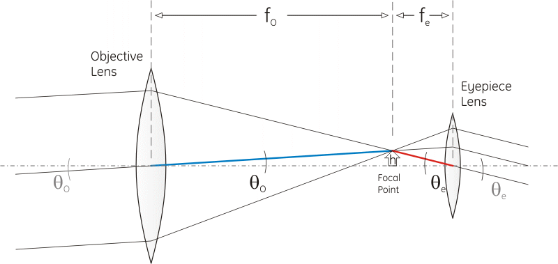

# 望远镜原理与放大倍数公式原理

关于望远镜原理，就以两片凸透镜构成的开普勒式望远镜为例(一凹一凸的伽利略式类似)：

一般都在解说望远镜原理的时候，都是以平行光线来说的，然后说物镜把平行光线汇聚于一点，然后目镜又把此焦点上的汇聚光线还原为平行光线，然后实现了放大。

这样解释乍看没什么问题，但是仔细一想就会觉得有问题。现实世界，哪来那么多平行光线？现实世界是四面八方好多光线的啊！这怎么解释？

而且，在上面那样的解释下，就会有个结论是：物镜与目镜的距离等于物镜焦距+目镜焦距，那么是个常数，那么不换目镜的话，都用不着调焦了。但是望远镜都是有调焦装置的。这又作何解释？ 

 

详细解释开来，是这样的。

首先望远镜看的都是很远的东西，物距往往远远大于物镜焦距。因此远处物体不管多大(大的如恒星，小的如远处高楼)或多小，物体上某一点发出的散射光线束，被整个物镜面所捕获的时候，这些光线都可以说（十足地）就是平行光线束了（而不是明显放射状光线束）。这样，一般的望远镜原理解说中的平行入射光束的来源就是这样。

考虑成像的时候，其实只需对任一点分析清楚就可以了。其他点都是类似的。所以望远镜原理的一般解说，都是拿平行光线来说事。

 

然后，这束几乎平行的光透过物镜后，会基本汇聚于焦点处。或者说，即使不按平行线来理解，那也会发生凸透镜成实像效应的（物体上任一点成像于像平面上的一个点上）。但因为物距>>物镜焦距，那么像距几乎就会等于物镜焦距，且物体上该点成像后的像可以说就在物镜焦平面上，且必然非常挨着焦点。这样看，其效果和上面理解成平行线是一样的。

这束光经过汇聚点后，继续前进，来到了目镜处。在目镜处，又来了一次逆聚光，重新还原形成了(几乎)平行光。这束(几乎）平行光入射眼睛后，在视网膜上形成了实像点。这样，眼睛就看到了这个原物体上的那个点了。

 

整体看，对单个点，过程就是光线经过物镜后会聚，经过目镜后发散，经过瞳孔晶状体后又会聚。

 

为什么口径越大，所看到的越亮呢？粗略地说，整个物镜面上接收到的该点的光（接收到的光量与物镜口径平方正比），最后都会汇聚于视网膜上的(面积为0)实像点了。因此说，口径越大，所看到的越亮；收集光的口子大嘛。（关于为什么放大倍数越大越暗，可以这样理解，物体表面单位面积的表面发出的等量光在高倍下在视网膜上所成像小，因此光量更集中；放大倍数高的时候，视网膜上所成像大，更分散。当然这只是大概的解释)

 

物体上的任一点散射到物镜面上的所有点最后会合于视网膜上某点了，那么物体上其他点也会这样的。于是，视网膜上形成了了经过望远镜双凸透镜后的像。

 

像虽然形成于视网膜上了。但是还有个放大率的问题。

关于放大率，还以物体上一点最终散射到物镜面上的近似平行光来解释。看图中蓝色与红色线，分别都是过物镜与目镜镜心的，都不会发生折射。入射（几乎）平行光束与出射（几乎）平行光束会分别平行于他们。放大倍数可以根据红蓝这两条线得到。放大倍数指的是视角的放大。根据简单的三角函数关系可知道，当入射平行光与光轴夹角不大的时候，出射入射夹角比就近似等于两个焦距的比，这正好是放大倍数。

如果希望进一步增大放大倍数，那么就是目镜缩小焦距然后更凑近物镜，那么图中红色线会更倾斜。足够倾斜后，红线的延长线就没法和物镜相交了（只能相较于镜筒壁），这说明这时候该点其实已经跑出目镜视野了。只有与物镜目镜光轴更小夹角的平行线束才能进入视野。这说明了，目镜焦距越小，看到的视野越小。

 

另外，如果物距并不远远大于焦距，那么入射光束就没那么平行，所成的实像点就离焦平面比较远。这时候，物镜与目镜距离，就不是两个焦距之和了，而是要比这个和大一点。这也解释了为什么（不可换目镜的）望远镜都还是有调焦装置的。看远近不同的东西，还是需要不同的物镜目镜距离的嘛。

 

总起来说，望远镜是光依次经过物镜、目镜、眼睛晶状体三个凸透镜，最后把原物在视网膜上成了实像。由于物镜目镜的巧妙组合，正好所成的是比眼睛直接看，放大的（且因为可能汇聚了更多光，因此可能更亮）像而已。物镜目镜之间的距离，严格说不是等于两个焦距之和，而是物镜像距与目镜焦距之和。

【参考】
- http://www.rocketmime.com/astronomy/Telescope/Magnification.html
- http://hyperphysics.phy-astr.gsu.edu/hbase/geoopt/teles2.html
